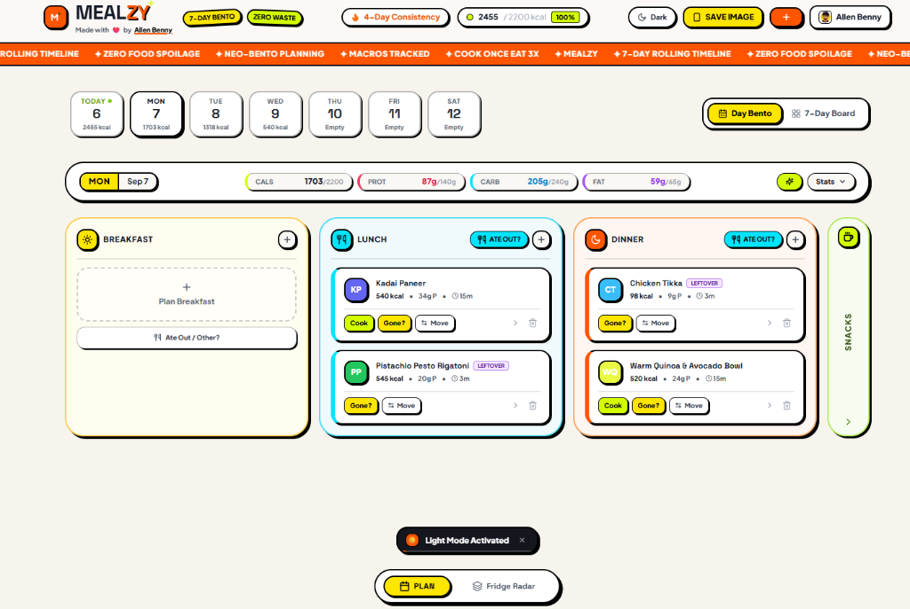
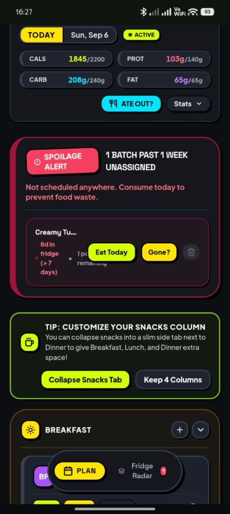
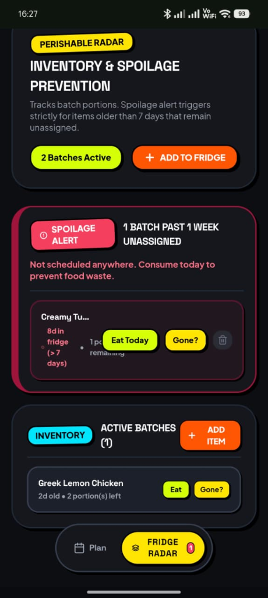

<div align="center">

  

  # MEALZY
  ### The Neo-Brutalist, Zero-Waste 7-Day Meal Planner

  [](https://nextjs.org/)
  [](https://react.dev/)
  [](https://www.typescriptlang.org/)
  [](https://tailwindcss.com/)
  [](https://dexie.org/)
  [](https://capacitorjs.com/)
  [](LICENSE)
  [](https://allenbenny.me/)

  <p align="center">
    <b>Plan what to make. Track macros in real time. Zero food rot. Zero cloud subscription fees.</b>
    <br />
    A local-first, privacy-respecting meal planner with seamless Google Drive sync and high-energy Neo-Brutalist design.
  </p>

  [Live Demo](https://officiallygod.github.io/MEALZY) • [Documentation](#overview) • [Architecture](#system-architecture) • [Getting Started](#local-development--compilation)

</div>

---

## Visual Tour & Screenshots

<div align="center">

### Desktop 7-Day Bento Board & Real-Time Macro Tracker


<br/><br/>

| Mobile Day Bento View | Mobile Zero-Waste Fridge Radar |
| :---: | :---: |
|  |  |

</div>

---

## Overview

Traditional meal planning applications often introduce cognitive friction through rigid calendar grids, complex recipes, or costly proprietary cloud backends. MEALZY provides a streamlined, responsive solution with:

- **Rolling 7-Day Timeline:** Anchored strictly to today. Past days drop off automatically, so you only focus on upcoming meals.
- **Hybrid Bento Interface:** Effortlessly toggle between single-day deep focus (Day Bento) and a full-week bird's-eye view (7-Day Kanban).
- **Tactile Drag-and-Drop & Quick Move:** Fluidly organize Breakfast, Lunch, Dinner, and Snacks.
- **Smart "Ate Out / Dining Out" Engine:** Going to a restaurant or ordering takeout? Log it in seconds, and Mealzy automatically pushes your planned dishes to tomorrow (or saves them to the fridge), complete with leftover takeout tracking.
- **Cook Once, Eat Multiple:** Mark batch dishes with multi-portion yields (2x to 4x). Subsequent meals are automatically scheduled across upcoming days with linked tags.
- **Perishable Fridge Radar:** Tracks home-cooked batches and alerts you before items reach extended storage limits (3+ days and 7+ days).
- **Client-Side AI Heuristics:** Curated recipes, instant Smart Auto-Fill for empty slots, and pantry rescue recommendations without external API dependencies.
- **Zero-Cost Google Drive Sync:** Keep all your data completely private in your own Google Drive `appDataFolder`. No central database or third-party tracking.

---

## System Architecture

MEALZY is structured as a local-first Progressive Web Application with client-side persistence and optional cross-device cloud synchronization.

```
+-------------------------------------------------------------+
|                     Presentation Layer                      |
| Next.js 15 (App Router, React 19) + Tailwind CSS            |
+-------------------------------------------------------------+
|                      State & Persistence                    |
| Dexie.js (IndexedDB) + LocalStorage + Cookie Management     |
+-------------------------------------------------------------+
|                      Intelligence Engine                    |
| Client-Side Heuristic Model (Trends, Twists & Rescues)      |
+-------------------------------------------------------------+
|                  Cross-Device Sync Layer                    |
| Google Identity Services -> Google Drive (appDataFolder)   |
+-------------------------------------------------------------+
|                   Native Runtime Target                     |
| Capacitor 6 (Mobile Native Webview Packaging)              |
+-------------------------------------------------------------+
```

### Technology Stack

- **Framework:** Next.js 15 (React 19, Static HTML Export)
- **Styling:** Tailwind CSS with custom Neo-Brutalist design tokens
- **Motion & Interactions:** Framer Motion + Canvas Confetti
- **Client Database:** Dexie.js (IndexedDB with live reactive hooks)
- **Icons:** Lucide React
- **Mobile Runtime:** Capacitor 6 Core & CLI
- **Continuous Deployment:** GitHub Actions to GitHub Pages

---

## Key Features

### 1. Rolling Seven-Day Planner
The application dynamically calculates a rolling seven-day window starting from today. Past days are omitted from the primary interface to preserve planning focus. Users can toggle between:
- **Day Bento View:** Detailed inspection of individual meal slots, macros, and preparation metadata.
- **Seven-Day Overview:** Comprehensive visual board across all upcoming dates.

### 2. Leftover Distribution Engine
When recording a meal as cooked, users can specify portion yield (1x to 4x portions). The system automatically creates linked leftover records in subsequent meal slots and registers the batch within the perishable inventory tracker.

### 3. Perishable Inventory Monitoring (Fridge Radar)
Cooked batches and refrigerated meals are timestamped. If an item remains unconsumed beyond designated thresholds (3+ days), the interface presents priority consumption prompts. Users can:
- Assign the item to today's schedule with a single interaction.
- Log early completion ("Gone Already"), which removes related pending leftovers and issues a replan prompt.

### 4. Smart Auto-Fill & Nutrition Monitor
The header monitor tracks daily caloric intake and macronutrient splits (Protein, Carbs, Fats) against personal targets. Click the tactile Sparkle button to instantly Auto-Fill any unassigned meal slots using smart dietary heuristics.

### 5. Instant "Ate Out" Redistribution
When dining out or ordering takeout:
- Pick whether to push your planned meals forward to tomorrow or save them in the fridge.
- Specify leftover takeout portions to reheat for tomorrow's lunch.
- Includes a 5-second undo toast with celebratory confetti!

---

## Cloud Synchronization Architecture

MEALZY uses a zero-cost, decentralized cloud synchronization model that requires no centralized database infrastructure.

### Google Drive AppData Synchronization
- **Protocol:** Google OAuth 2.0 (PKCE via Google Identity Services)
- **Scope:** `https://www.googleapis.com/auth/drive.appdata`
- **Storage:** An encrypted snapshot file (`mealzy_sync.json`) stored within the user's private Google Drive application data folder.
- **Benefits:**
  - Zero centralized infrastructure overhead or database hosting costs.
  - User meal history and dietary data remain strictly within the user's personal Google account.
  - Multi-device synchronization functions across web browsers, tablets, and native mobile installs.

---

## Environment Configuration & Security

All environment variables follow standard client-side prefixing rules. No private server keys are stored in the repository.

### Configuration Template (.env.example)

```bash
# Public Google OAuth Client ID for Google Drive AppData Sync
NEXT_PUBLIC_GOOGLE_CLIENT_ID=""

# Application Deployment URL
NEXT_PUBLIC_APP_URL="https://officiallygod.github.io/MEALZY"

# Optional: Supabase configuration (if utilizing alternative Postgres storage)
NEXT_PUBLIC_SUPABASE_URL=""
NEXT_PUBLIC_SUPABASE_ANON_KEY=""
```

### GitHub Actions Secrets
For deployments hosted on GitHub Pages, configure the following repository secret or variable under Settings -> Secrets and variables -> Actions:
- `NEXT_PUBLIC_GOOGLE_CLIENT_ID`: The public Google OAuth 2.0 Client ID generated in the Google Cloud Console.

---

## Local Development & Compilation

### Prerequisites
- Node.js 18.18.0 or higher (Node.js 22 LTS recommended)
- npm 8.0.0 or higher

### Installation
```bash
git clone git@github.com:officiallygod/MEALZY.git
cd MEALZY
npm install
```

### Development Server
```bash
npm run dev
```
Access the application locally at `http://localhost:3000`.

### Production Build & Static Export
```bash
npm run build
```
Compiled static assets are generated in the `out/` directory, ready for static web hosting.

### Native Mobile Packaging (Capacitor)
```bash
# Add native platform targets
npx cap add android
npx cap add ios

# Sync static build assets to native projects
npm run build
npx cap sync

# Open in platform IDEs
npm run cap:open:android
npm run cap:open:ios
```

---

## Continuous Deployment

This repository includes an automated GitHub Actions workflow located at `.github/workflows/deploy.yml`. 

To activate automated deployment:
1. Navigate to repository Settings -> Pages.
2. Under Build and deployment -> Source, select "GitHub Actions".
3. Subsequent commits to the `main` branch will automatically compile and deploy the static export to GitHub Pages.

---

## Author

Crafted with love by **[Allen Benny](https://allenbenny.me/)**.

---

## License

This project is distributed under the MIT License. See [LICENSE](LICENSE) for details.
